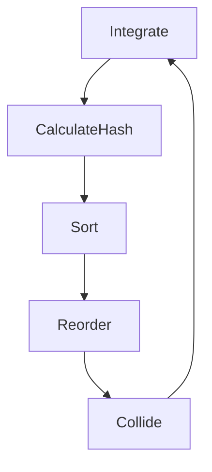

# Software Requirements Specification
## Fluid Engine

Version 0.3   
Prepared by Šimon Tupý 3.C   
SSPŠaG  
August 10, 2022

<!--TODO: add references-->
# Table of Contents
* 1 [Introduction](#1-introduction)
  * 1.1 [Document Purpose](#11-document-purpose)
  * 1.2 [Definitions, Acronyms and Abbreviations](#12-definitions-acronyms-and-abbreviations)
  * 1.3 [Target Audience](#13-target-audience)
  * 1.4 [Additional Information](#14-additional-information)
    * 1.4.1 [Navier-Stokes Equations](#141-navier-stokes-equations) 
    * 1.4.2 [Rules](#142-rules) 
    * 1.4.3 [Eulerian simulation](#143-eulerian-simulation) 
    * 1.4.4 [Lagrangian simulation](#144-lagrangian-simulation) 
  * 1.5 [Contacts](#15-contacts)
  * 1.6 [References](#16-references)
* 2 [Product Overview](#2-product-overview)
  * 2.1 [Product Perspective](#21-product-perspective)
    * 2.1.1 [SPH simulation](#211-sph-simulation)
    * 2.1.1 [FLIP simulation](#212-flip-simulation)
  * 2.2 [Product Functions](#22-product-functions)
  * 2.3 [User Groups](#23-user-groups)
    * 2.3.1 [GPU compute newcomers](#231-gpu-compute-newcomers)
  * 2.4 [Product Environment](#24-product-environment)
  * 2.5 [User Environment](#25-user-environment)
  * 2.6 [Limitations and Implementation Details](#26-limitations-and-implementation-details)
    * 2.6.1 [Simulation scale and speed](#261-simulation-scale-and-speed)
  * 2.7 [Assumptions and Dependencies](#27-assumptions-and-dependencies)
    * 2.7.1 [Assumptions](#271-assumptions)
    * 2.7.2 [Dependencies](#272-dependencies)
* 3 [Interface Requirements](#3-interface-requirements)
  * 3.1 [User Interface](#31-user-interface)
    * 3.1.1 [Viewport Window](#311-viewport-window)
      * 3.1.1.1 [Saving and Loading Scenes](#3111-saving-and-loading-scenes)
      * 3.1.1.2 [Camera Controls](#3112-camera-controls)
    * 3.1.2 [Profiler Window](#312-profiler-window)
      * 3.1.2.1 [Frame Time Graph](#3121-frame-time-graph)
      * 3.1.2.2 [Frame Time Counter](#3122-frame-time-counter)
      * 3.1.2.3 [Renderer Statistics](#3123-renderer-statistics)
    * 3.1.3 [Scene Hierarchy Window](#313-scene-hierarchy-window)
      * 3.1.3.1 [Entity List](#3131-entity-list)
    * 3.1.4 [README Window](#314-readme-window)
  * 3.2 [Hardware Interface](#32-hardware-interface)
  * 3.3 [Software Interface](#33-software-interface)
* 4 [System properties](#4-system-properties)
  * 4.1 [ECS-Based Scene System](#41-ecs-based-scene-system)
    * 4.1.1 [Description and Importance](#411-description-and-importance)
    * 4.1.2 [Inputs and Outputs](#412-inputs-and-outputs)
    * 4.1.3 [Function Specification](#413-function-specification)
  * 4.2 [Event System](#42-event-system)
    * 4.2.1 [Description and Importance](#421-description-and-importance)
    * 4.2.2 [Inputs and Outputs](#422-inputs-and-outputs)
    * 4.2.3 [Function Specification](#423-function-specification)
  * 4.3 [Application](#43-application)
    * 4.3.1 [Description and Importance](#431-description-and-importance)
    * 4.3.2 [Inputs and Outputs](#432-inputs-and-outputs)
    * 4.3.3 [Function Specification](#433-function-specification)
  * 4.4 [Ref](#44-ref)
    * 4.4.1 [Description and Importance](#441-description-and-importance)
    * 4.4.2 [Inputs and Outputs](#442-inputs-and-outputs)
    * 4.4.3 [Function Specification](#443-function-specification)
  * 4.5 [Debugger](#45-debugger)
    * 4.5.1 [Description and Importance](#451-description-and-importance)
    * 4.5.2 [Inputs and Outputs](#452-inputs-and-outputs)
    * 4.5.3 [Function Specification](#453-function-specification)
  * 4.6 [Editor](#46-editor)
    * 4.6.1 [Description and Importance](#461-description-and-importance)
    * 4.6.2 [Inputs and Outputs](#462-inputs-and-outputs)
    * 4.6.3 [Function Specification](#463-function-specification)
  * 4.7 [Renderer](#47-editor)
    * 4.7.1 [Buffers](#471-buffers)
      * 4.7.1.1 [Frame Buffer](#4711-frame-buffer)
        * 4.7.1.1.1 [Description and Importance](#47111-description-and-importance)
        * 4.7.1.1.2 [Inputs and Outputs](#47112-inputs-and-outputs)
        * 4.7.1.1.3 [Function Specification](#47113-function-specification)
      * 4.7.1.2 [Vertex Buffer](#4712-vertex-buffer)
        * 4.7.1.2.1 [Description and Importance](#47121-description-and-importance)
        * 4.7.1.2.2 [Inputs and Outputs](#47122-inputs-and-outputs)
        * 4.7.1.2.3 [Function Specification](#47123-function-specification)
      * 4.7.1.3 [Index Buffer](#4713-index-buffer)
        * 4.7.1.3.1 [Description and Importance](#47131-description-and-importance)
        * 4.7.1.3.2 [Inputs and Outputs](#47132-inputs-and-outputs)
        * 4.7.1.3.3 [Function Specification](#47133-function-specification)
      * 4.7.1.4 [Uniform Buffer](#4714-uniform-buffer)
        * 4.7.1.4.1 [Description and Importance](#47141-description-and-importance)
        * 4.7.1.4.2 [Inputs and Outputs](#47142-inputs-and-outputs)
        * 4.7.1.4.3 [Function Specification](#47143-function-specification)
    * 4.7.2 [Triangle Mesh](#472-triangle-mesh)
      * 4.7.2.1 [Description and Importance](#4721-description-and-importance)
      * 4.7.2.2 [Inputs and Outputs](#4722-inputs-and-outputs)
      * 4.7.2.3 [Function Specification](#4723-function-specification)
    * 4.7.3 [Camera](#473-camera)
      * 4.7.3.1 [Description and Importance](#4731-description-and-importance)
      * 4.7.3.2 [Inputs and Outputs](#4732-inputs-and-outputs)
      * 4.7.3.3 [Function Specification](#4733-function-specification)
    * 4.7.4 [Material](#474-material)
      * 4.7.4.1 [Description and Importance](#4741-description-and-importance)
      * 4.7.4.2 [Inputs and Outputs](#4742-inputs-and-outputs)
      * 4.7.4.3 [Function Specification](#4743-function-specification)
    * 4.7.5 [Shader](#475-shader)
      * 4.7.5.1 [Description and Importance](#4751-description-and-importance)
      * 4.7.5.2 [Inputs and Outputs](#4752-inputs-and-outputs)
      * 4.7.5.3 [Function Specification](#4753-function-specification)
    * 4.7.6 [Vertex Array Object](#476-vertex-array-object)
      * 4.7.6.1 [Description and Importance](#4761-description-and-importance)
      * 4.7.6.2 [Inputs and Outputs](#4762-inputs-and-outputs)
      * 4.7.6.3 [Function Specification](#4763-function-specification)
* 5 [Non-Functional Requirements](#5-non-functional-requirements)
   * 5.1 [Performance](#51-performance)
   * 5.2 [Security](#52-security)
   * 5.3 [Reliability](#53-reliability)
   * 5.4 [Project Documentation](#54-project-documentation)
   * 5.5 [User Documentation](#55-user-documentation)

<!--INTRODUCTION-->
# 1. Introduction  
## 1.1 Document Purpose
The purpose of this document is to present a detailed description of a the application. It will explain its purposes, features, interface, and what the application and its accompanying systems will do.
## 1.2 Definitions, Acronyms and Abbreviations
| Term | Definition    |
| ---- | ------- |
| Software Requirements Specification  |  A document that completely describes all of the functions of a proposed system and the constraints under which it must operate. For example, this document. |
| CFD | Computational fluid dynamics - the use of applied mathematics, physics and computational software to visualize how a gas or liquid flows, as well as how it affects objects as it flows past.  |
|Advection|The evolution of mass forwards in time using a velocity field. |
|Convection|The process of transferring heat via circulation of movement of the fluid. |
|Lagrangian (methods)|Methods that move a fluid volume (ie. by using advection), most commonly used with particles. |
|Eulerian (methods)|Methods utilizing a grid-based approach to fluid simulation. |
| SPH | Smoothed particle hydrodynamics - the most common form of CFD. |
| FLIP | Fluid-Implicit-Particle method used in CFD. Utilizes fully Lagrangian particles to eliminate convective transport.|
| Device | A device capable of running CUDA code (ie. an Nvidia GPU) |
| Host | The CPU and CPU related code |
| <kbd>Key</kbd> | A keyboard key or mouse button declaration. |

## 1.3 Target Audience
This document is intended for both stakeholders and the developers of the application.
## 1.4 Additional Information
### 1.4.1 Navier-Stokes Equations
Fluids are governed by the incompressible Navier-Stokes equations, which look like this: 

${\partial \vec{u} \over \partial t} + \vec{u} \times \nabla \vec{u} + {1 \over \rho} = \vec{g} + v \nabla \times \nabla \vec{u}$
(Acceleration = Advection + External force + Viscosity - Pressure)
$\nabla \times \vec{u} = 0$
(Divergence has to be 0 - thus enforcing the rule of incompressibility)

|Equation|Description|
|-|-|
|$\vec{u} = (x, y, z)$|**Velocity**  of the fluid $[m / s]$|
|$\rho$|**Density** of the fluid $[Kg / m^{3} ]$|
|$p = {\vec{F} \over A} $|**Pressure** exerted by the fluid $[Pa]$|
|$\vec{g} = (x, y, z)$|**Gravitational force** applied to the fluid $[m/s^{-2}]$|
|$v$|**Viscosity** of the fluid.|
 
### 1.4.2 Rules
There are also several rules the fluid simulation has to abide by: 
|Rule|Description|
|-|-|
|Conservation of Energy|The amount of energy in our fluid must remain the same over time (or at the very least not deviate by a large margin).|
|Conservation of Mass|The total mass of our fluid must remain the same over time (or at the very least not deviate by a large margin).|
|Balance of Momentum|The momentum of the fluid can only be changed by external force. |
|Incompressibility|The fluid's volume should never change on its own. ( $\nabla \times \vec{u} = 0$ )|

### 1.4.3 Eulerian simulation
This method revolves around a global grid containing and representing the fluid volume, forces, density, pressure and viscosity. It provides an easy and performant way of computing the pressure of a given cell. For non-sparse volumes the sampling is also constant, due to array access times. The simulation also provides great stability at relatively low cost. 
### 1.4.4 Lagrangian simulation
This method represents the fluid volume as particles - this provides us with an easy method of calculating advection, however, the method, by itself isn't very stable and needs small timesteps, increasing its computational cost. 

## 1.5 Contacts
E-mail: simontupy64@gmail.com
## 1.6 References
* Fluid Simulation Terminology Some Terms and Equations (https://www.cs.purdue.edu/cgvlab/courses/434/434Spring2022/lectures/CS434-14-Fluids.pdf)
* Review of smoothed particle hydrodynamics - Journals (https://royalsocietypublishing.org/doi/10.1098/rspa.2019.0801)
* The Rust Graphics Meetup (https://github.com/gfx-rs/meetup)
* FLIPViscosity3D (https://github.com/rlguy/FLIPViscosity3D)
<!--OVERVIEW-->
# 2. Product Overview
## 2.1 Product Perspective
This piece of software will be simple fluid simulation tool utilizing GPU-based CFD. The user will by provided with a simple, minimal interface that will enable them to manipulate the given scene, load, save and create new scenes, toggle various simulation parameters and visualize the given simulation. As noted in the initial proposal, the project will contain at least one example of a fluid simulation, however, at the current rate of progress, it is expected that two instances will be implemented. 
### 2.1.1 SPH simulation
The first (and most basic) fluid simulation that will be implemented will be a simple SPH simulation, that will provide the users with basic knowledge of CFD. 
This implementation will utilize both Lagrangian and Eulerian methods of simulation (this way we can get the best of both worlds and increase the overall performance, albeit at the cost of simulation accuracy). 
### 2.1.2 FLIP simulation
A more advanced approach to fluid simulation, with a specific focus on more viscous fluids (ie. honey or oil). A FLIP approach was chosen due to its higher stability and the fact that it is fundamentally different to the SPH simulation, thus providing the users with the option of comparing the two methods. It is expected that most of the development time will be spent working on improving and optimizing this particular method and its various subsystems. The implementation will be heavily inspired by [this](https://github.com/rlguy/FLIPViscosity3D) FLIP implementation. 
## 2.2 Product Functions
The main goal of this project is to enable users to quickly prototype and create, at this point in development, small-scale fluid simulations. Furthermore, the project will be used in the future as a showcase-style application for different CFD methods. 
## 2.3 User Groups
### 2.3.1 GPU compute newcomers 
The project can serve as a (hopefully) decent learning tool for programmers entering the world of GPU compute and CUDA showcasing different methods of manipulating memory on the device (ie. deep copying) or working with kernels. The project will provide a concise explanation of most fluid simulation methods and CUDA related code. 
## 2.4 Product Environment
The application will run an any system capable of running CUDA (the target system has to have an Nvidia GPU, and be considered as a CUDA-compliant device) and compiling the project. 
## 2.5 User Environment
The application will provide the user with a simple, single-window interface. 
## 2.6 Limitations and Implementation Details
### 2.6.1 Simulation scale and speed
The main limitation of the application will be performance, which directly correlates to the amount of CUDA cores and memory speed of the target device. For the sake of keeping the simulation running in real (or semi-real) time all the necessary data (particle positions, velocity, density, viscosity etc.) will be kept on the device in the format of buffers - this means that the simulation size is directly capped by the amount device memory. 

## 2.7 Assumptions and Dependencies
### 2.7.1 Assumptions
It is expected that the user will be able to download, and get the application running by using the [Getting up and running](https://github.com/Goubermouche/FluidEngine/blob/master/README.md) section of the readme file. 
### 2.7.2 Dependencies
The list of currently used dependencies can be found [here](https://github.com/Goubermouche/FluidEngine/blob/master/README.md). Every dependency, excluding the CUDA toolkit and Vulkan SDK will be installed when the user clones the repository. 
#### 2.7.2.1 CUDA 
Even though [OpenCL](https://www.khronos.org/opencl/) provides a unified development environment for creating applications utilizing the power of GPU compute CUDA was chosen due to its (more often than not) superior performance and due to the fact that [glm](https://github.com/g-truc/glm) (the math library that is used across the project) natively supports it, thus providing us with very useful and performant functions for vector calculations - pushing the performance even further. 

<!--INTERFACE-->
# 3. Interface Requirements
## 3.1 User Interface
The user will be provided with a simple, window-based interface, that will enable them to profile, save, load and edit scenes. In the beginning, most of the operations will be located inside simple context menus, however, later on a proper UI system will be implemented. The interface can be freely edited and transform to the user's liking thanks to the window-panel system. 

<!--VIEWPORT-->
### 3.1.1 Viewport Window
The viewport window contains an OpenGL framebuffer texture, that displays the current scene. 
#### 3.1.1.1 Saving and Loading Scenes
To save and load scenes the user can right click the viewport and select either the "Save Scene" or "Load Scene" option. The save scene option also provides a simple shortcut - <kbd>Ctrl</kbd> + <kbd>S</kbd> - which will save the currently loaded scene, if a default filepath is provided. 

#### 3.1.1.2 Camera Controls 
The built-in arc ball camera has three movement functions: orbit (<kbd>MMB</kbd>), pan (<kbd>MMB</kbd>+<kbd>Shift</kbd>) and zoom (<kbd>Scroll</kbd>)

<!--PROFILER-->
### 3.1.2 Profiler Window
The profiler window displays useful information about the current scene. 
#### 3.1.2.1 Frame Time Graph 
The frame time graph is a basic graph UI component that displays the time each frame took to compute. The graph is comprised of many rectangular shapes, that are scaled by the current delta time value. 
#### 3.1.2.2 Frame Time Counter
Since the frame time graph by itself does not provide exact information we need another UI component - the frame time counter displays 3 values: max, min and current delta time values in milliseconds. 
#### 3.1.2.3 Renderer Statistics 
The profiler will additionally provide a simple renderer statistics: the current count of all vertices that are being renderer in this frame, the draw call count and whether VSync is enabled. 

<!--SCENE HIERARCHY PANEL-->
### 3.1.3 Scene Hierarchy Window
The scene hierarchy window displays a list of all entities in the current scene. 
#### 3.1.3.1 Entity List 
The individual entities are displayed using a tree diagram. The individual tree nodes respond to <kbd>M2</kbd> events and produce a simple context menu containing the following options: 
- Delete - Deletes the entity. 
- Rename - Creates a rename input field and renames the entity. 
- Create Empty - Creates an empty child entity parented to the entity.    
  
In the case of the <kbd>RMB</kbd> event not being handled by any specific tree node, the list creates a different context menu containing the following options: 
- Create Empty - Creates an empty entity. 
- Save Scene - Opens a save file dialog window and saves the current scene. 
- Load Scene - Opens a load file dialog window and loads the selected scene. 

### 3.1.4 README Window
Some scenes may also provide a simple README panel containing relevant information.
## 3.2 Hardware Interface
Due to the project being based on CUDA a compliant device is required to run the simulations (NVidia GPU). 
## 3.3 Software Interface
N/A

<!--SYSTEM-->
# 4. System properties
<!--SCENE-->
## 4.1 ECS-Based Scene System
### 4.1.1 Description and Importance
The core of the application is the scene system. Due it's high performance and easy extensibility we've chosen to use and ECS-based system (entity component system), where every entity has a certain amount of components (mesh component, material component, simulation component etc.). The Scene itself is a registry containing n entities. Each entity has its ID (handle) and a reference to its parent scene.
### 4.1.2 Inputs and Outputs
Entity creation and deletion, the ability to change the parent/child of a certain entity. Entity ID getters, transform conversion functions (Local -> World space and vice versa). Entity queries (entity count, entity views). Furthermore the scene implements update and render methods for updating and rendering the entire scene (note that the render method will probably be moved to a separate scene renderer class in the future).
### 4.1.3 Function Specification
Most of the methods are wrappers for the respective entt functions. Currently available components: 
- FLIPSimulationComponent
- SPHSimulationComponent
- IDComponent
- MaterialComponent
- MeshComponent
- TagComponent
- TransformComponent
- RelationshipComponent
  
Every component implements a cereal serialization function that is used to save and load the specific component. 
<!--EVENTS-->
## 4.2 Event System
### 4.2.1 Description and Importance
The application's input system relies on a simple, blocking event system. Every "layer" (Editor, editor panels etc.) that intercepts any event implements an OnEvent method and decides whether or not the event is considered as "Processed" or if it gets to bubble further.
### 4.2.2 Inputs and Outputs
The inputs are generated by the GLFW polling system. The outputs are then "signals" sent to all listening layers. 
### 4.2.3 Function Specification
The system comprises of 2 elements: an abstract Event class and an EventDispatcher class. The event class holds information about the specific event, and the EventDispatcher dispatches the specified events inside OnEvent methods to other, more specific functions that deal with the event on their own. Currently, There are 14 event types: 
```cpp
// Window
WindowClose
WindowMinimize
WindowResize
WindowFocus
WindowLostFocus
WindowMoved
WindowTitleBarHitTest

// Keyboard
KeyPressed
KeyReleased
KeyTyped

// Mouse
MouseButtonPressed
MouseButtonReleased
MouseMoved
MouseScrolled
```

<!--APPLICATION-->
## 4.3 Application 
### 4.3.1 Description and Importance 
The application class is the core of the project. It handles every event and functions as the main entry point. 
### 4.3.2 Inputs and Outputs
Since this is the highest-level object in the entire project all inputs and outputs pass through/originate from it. 
### 4.3.3 Function Specification
The application class, in its essence, is a wrapper for the main loop. It is also the only object that can directly interact with it (however, utility functions such as Run and Close are provided). The application class manages the application window and the editor (Window events get passed down to the editor through the application and then bubble further). The application is a singleton class and all that is needed to do to start the application is to create an instance of it. 

<!--REF-->
## 4.4 Ref
### 4.4.1 Description and Importance 
The application's core data structure is the Ref. It is used as opposed to / as a replacement to shared pointers. 
### 4.4.2 Inputs and Outputs
N/A
### 4.4.3 Function Specification
Every class that we want to become/be used as a Ref has to publicly derive from the RefCounted class. This class stores the current reference count to that object, whenever a Ref is created from it. The Ref class enables us to intrusively access the same object from multiple places at the same time and it behaves very similarly to std::shared_ptr. 

<!--DEBUG-->
## 4.5 Debugger
### 4.5.1 Description and Importance 
The project has its own basic debugger/logger.
### 4.5.2 Inputs and Outputs
The debugger provides basic LOG, ERR, WARN and ASSERT macros, furthermore, it implements COMPUTE_SAFE and COMPUTE_CHECK macros utilized in CUDA/C++ code.
### 4.5.3 Function Specification
The debugger only works in the Debug configuration, however, a ENABLE_DEBUG_MACROS_RELEASE is available, and if it is implemented, the configuration check is ignored and debug macros remain active even in the release configuration. 

<!--EDITOR-->
## 4.6 Editor
### 4.6.1 Description and Importance 
The editor provides a basic user interface. It's core is the EditorPanel class, which then functions as a base class for other windows, namely the [ViewportPanel](#311-viewport-window) and [SystemInfo](#312-profiler-window) classes. 
### 4.6.2 Inputs and Outputs
The editor continually receives events from the application class and produces relevant results (see [User Interface](#31-user-interface) for more information).
### 4.6.3 Function Specification
The editor implements OnEvent and update functions. It also contains references to the current scene (scene context), the currently focused entity (selection context), and its very own panel manager. It also implements utility functions for setting and getting the scene and selection contexts, and for loading and saving the current scene context. The editor is a singleton class. 

<!--RENDERER-->
## 4.7 Renderer 
The renderer system has several components and provides utility functions and classes for drawing on the screen and managing the OpenGL context. 
<!--BUFFERS-->
### 4.7.1 Buffers 

<!--FRAME BUFFER-->
#### 4.7.1.1 Frame Buffer 
##### 4.7.1.1.1 Description and Importance
The frame buffer is a replacement for the default GLFW frame buffer and provides a way to draw to a set of textures. 
##### 4.7.1.1.2 Inputs and Outputs
To create a frame buffer the user has to provide a frame buffer description struct containing the sample count, width, height and a list of attached textures.
##### 4.7.1.1.3 Function Specification
Once the frame buffer gets bound every draw call gets directed into it and its texture attachments. 

<!--VERTEX BUFFER-->
#### 4.7.1.2 Vertex Buffer
##### 4.7.1.2.1 Description and Importance
The vertex buffer provides a way of interfacing with the OpenGL vertex buffer. 
##### 4.7.1.2.2 Inputs and Outputs
The vertex buffer can be either constructed by providing the size and data, or just the data by itself. The data can be updated later. 
##### 4.7.1.2.3 Function Specification
Once constructed, the vertex buffer can be provided to a vertex array object for drawing. 

<!--INDEX BUFFER-->
#### 4.7.1.3 Index Buffer
##### 4.7.1.3.1 Description and Importance
The index buffer provides a way of interfacing with the OpenGL index buffer. 
##### 4.7.1.3.2 Inputs and Outputs
The vertex buffer can be constructed by providing the necessary index data. 
##### 4.7.1.3.3 Function Specification
Once constructed, the index buffer can be provided to a vertex array object for drawing. 

<!--UNIFORM BUFFER-->
#### 4.7.1.4 Uniform Buffer
##### 4.7.1.4.1 Description and Importance
The uniform buffer provides a way of interfacing with the OpenGL uniform buffer. 
##### 4.7.1.4.2 Inputs and Outputs
The uniform buffer can be constructed by providing a size in bytes and a binding index. 
##### 4.7.1.4.3 Function Specification
Once constructed, the uniform buffer can be provided to material, where it will represent the uniform data of a specific shader. 

<!--TRIANGLE MESH-->
### 4.7.2 Triangle Mesh
#### 4.7.2.1 Description and Importance
The triangle mesh class is the default way of rendering meshes. It provides a simple, triangle-based representation of the specified mesh.
#### 4.7.2.2 Inputs and Outputs
To construct a triangle mesh the user has to provide a path to a .obj mesh file. 
#### 4.7.2.3 Function Specification
N/A

<!--CAMERA-->
### 4.7.3 Camera
#### 4.7.3.1 Description and Importance
The camera contains a view and projection matrix and can be position, rotated and scaled. 
#### 4.7.3.2 Inputs and Outputs
The camera can be constructed by providing the size, fov, near and far clip planes. 
#### 4.7.3.3 Function Specification
N/A

<!--MATERIAL-->
### 4.7.4 Material
#### 4.7.4.1 Description and Importance
The material class provides a way to set the uniforms of a shader in a persistent way. 
#### 4.7.4.2 Inputs and Outputs
The material can be constructed using a shader. 
#### 4.7.4.3 Function Specification
Once a shader is provided the material analyzes it and creates a uniform buffer. 

<!--SHADER-->
### 4.7.5 Shader
#### 4.7.5.1 Description and Importance
The index buffer provides a way of interfacing with the OpenGL shader program. 
#### 4.7.5.2 Inputs and Outputs
To create a shader a file path to the shader source file has to be provided. After the shader gets constructed a uniform buffer containing all the uniform values gets created.
#### 4.7.5.3 Function Specification
To aid with generating the uniform buffer SPIR-V generates the shader binaries - this also enable shader caching. 

<!--VERTEX ARRAY-->
### 4.7.6 Vertex Array Object
#### 4.7.6.1 Description and Importance
The index buffer provides a way of interfacing with the OpenGL vertex array object. 
#### 4.7.6.2 Inputs and Outputs
After construction, the user can bind a vertex and index buffer to it, after this, the vertex array can be bound and used by OpenGL to draw the item. 
#### 4.7.6.3 Function Specification
N/A

<!--SPH-->
### 4.8 SPH Implementation
#### 4.8.1 Description and Importance
A basic implementation of the SPH algorithm described [here](#211-sph-simulation).
#### 4.8.2 Inputs and Outputs
The simulation constructor takes in a simple description struct. After the simulation updates the user can retrieve a vertex array containing all relevant data or individual arrays. 
#### 4.8.3 Function Specification
The simulation loop follows the graph below: 


<!--CAMERA-->
### 4.8 Triangle Mesh
#### 4.8.1 Description and Importance
#### 4.8.2 Inputs and Outputs
#### 4.8.3 Function Specification

<!--REQUIREMENTS-->
# 5. Non-Functional Requirements
## 5.1 Performance
It is of vital importance that the application and the included fluid simulations run at a reasonable framerate on aptly equipped systems. 
## 5.2 Security
N/A
## 5.3 Reliability
The application should run without crashing or uncalled-for stuttering. The risk of memory leaks should also be minimized. 
## 5.4 Project Documentation
The project will eventually provide a Github wiki page that will explain its core concepts and inner workings. 
## 5.5 User Documentation
The project's [wiki page](#54-project-documentation) will also include a section on proper usage of the application. 
